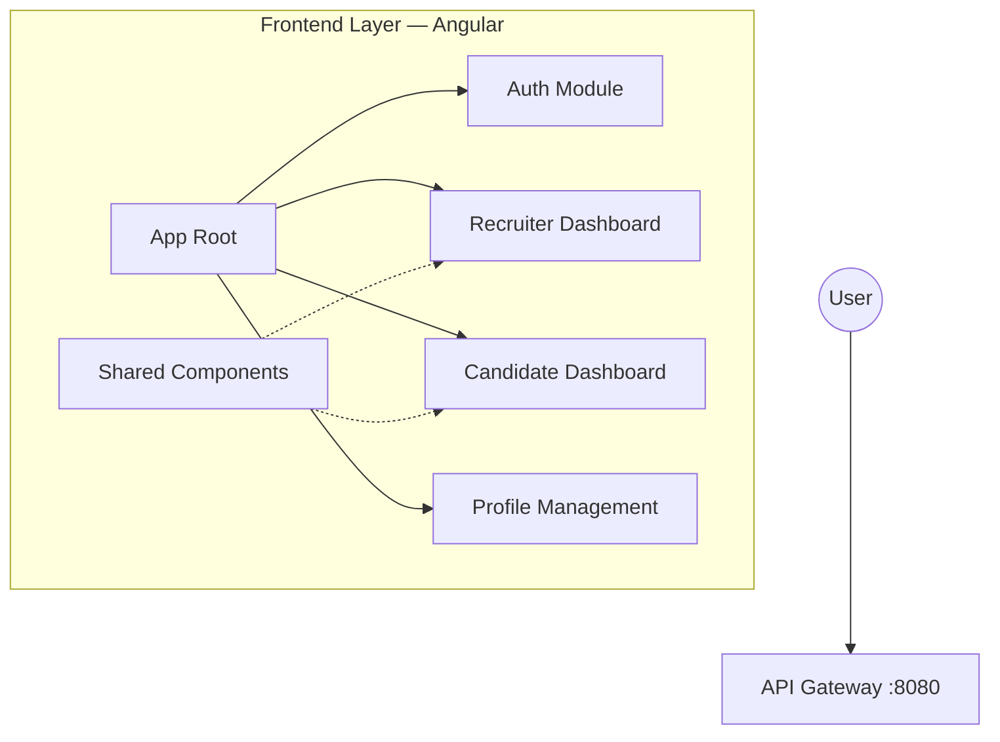
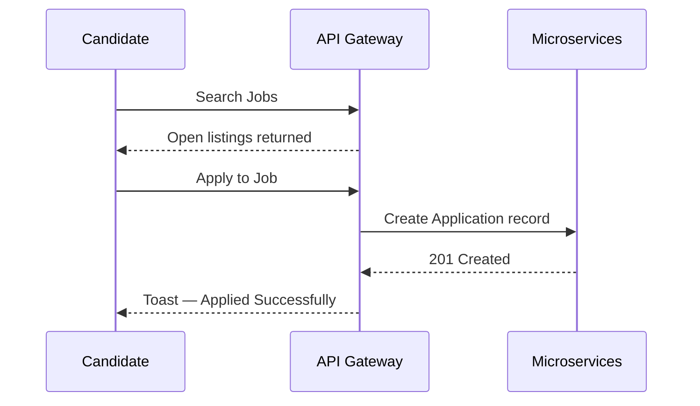

# HireConnect — Frontend Platform

> *Bridging talent and opportunity at scale.*

---

## What is HireConnect?

HireConnect is a modern recruitment platform that connects ambitious candidates with top-tier recruiters. This repository holds the Angular frontend — fast, accessible, and built with the same intentionality you'd expect from a production-grade hiring product.

Inspired by platforms like Naukri.com, HireConnect goes further: purpose-built dashboards, real-time notifications, and a clean separation of recruiter and candidate workflows.

---

## Architecture at a Glance



---

## Tech Stack

| Layer | Choice |
|---|---|
| Framework | Angular 17+ (Standalone Components) |
| State | RxJS — Observables & Subjects |
| Styling | Vanilla CSS3 with custom design tokens |
| Networking | HttpClient + JWT Interceptors |
| Payments | Razorpay Gateway |
| Auth | Google OAuth2 |

---

## Features

### Recruiter Side
- **Job Lifecycle** — post, edit, close, and track listings in one place
- **Application Review** — browse applicants, download resumes
- **Interview Scheduling** — set up sessions across in-person, phone, or video
- **Featured Listings** — pay to promote jobs via Razorpay integration

### Candidate Side
- **Smart Search** — filter by location, salary range, job type, and skills
- **One-Click Apply** — frictionless applications for tracked roles
- **Profile Builder** — resume upload, skills, experience — all in one view
- **Live Notifications** — application status updates and interview alerts

---

## Getting Started

### Prerequisites

- Node.js `v18+`
- npm `v9+`

### Setup

```bash
# 1. Clone the repo
git clone https://github.com/Dishagujar26/HireConnect-Frontend.git

# 2. Install dependencies
cd HireConnect-Frontend
npm install

# 3. Start the dev server
npm start
```

### Environment Config

Point the app at your backend by editing `src/environments/environment.ts`:

```ts
export const environment = {
  production: false,
  apiGatewayUrl: 'http://localhost:8080'
};
```

---

## Candidate Flow



---

## Project Structure (overview)

```
src/
├── app/
│   ├── auth/           # Login, registration, OAuth
│   ├── recruiter/      # Recruiter dashboard & tools
│   ├── candidate/      # Candidate search & profile
│   ├── shared/         # Reusable components & services
│   └── core/           # Guards, interceptors, models
├── environments/
│   ├── environment.ts
│   └── environment.prod.ts
└── assets/
```

---

## Contributions

This project is built and maintained by **Adarsh Mishra**.  
Found a bug or have a suggestion? Open an issue or reach out directly.

---

*© 2026 HireConnect. All rights reserved.*
